# Отчёт по лабораторной работе №0
## Дисциплина: «Проектирование телекоммуникационных систем на программируемых логических интегральных схемах»
## Название: «Счётчик»

**Выполнил:**  
Студент группы ИКТ-43
Гайдуков А. М. 

---

Цель выполнения лабораторной работы:
Создание простейшего счётчика на Verilog, его симуляция на ПЛИС.

---

## 1. Ход лабораторной работы

Создание проекта и выбор платы

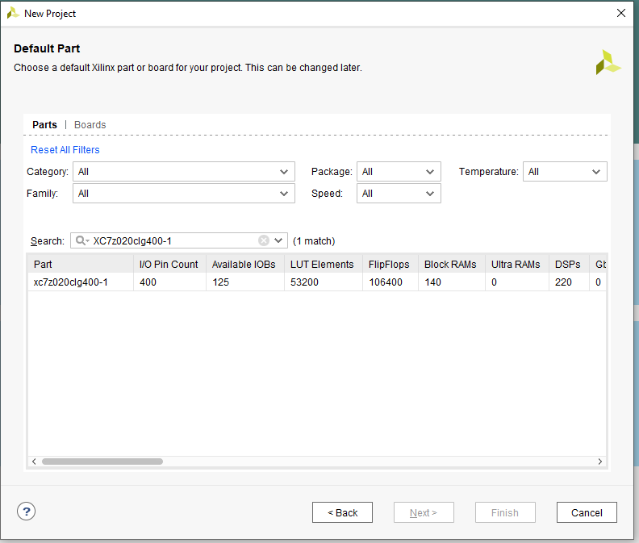 

Добавление файлов из архива zynq_mybase_src.zip в проект

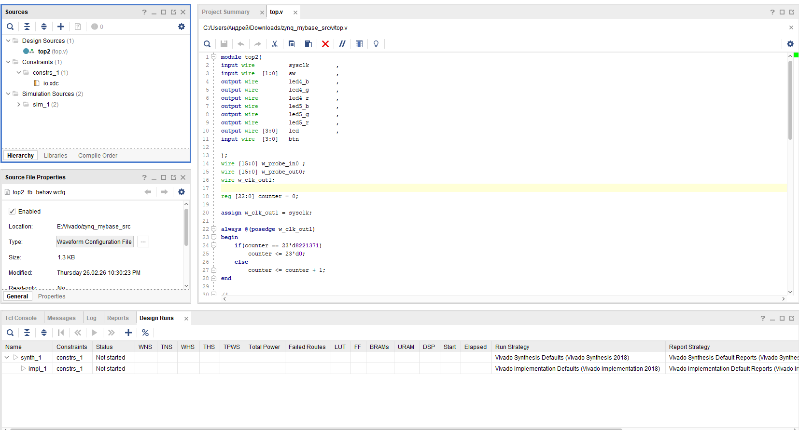  

Настройка рабочей частоты платы

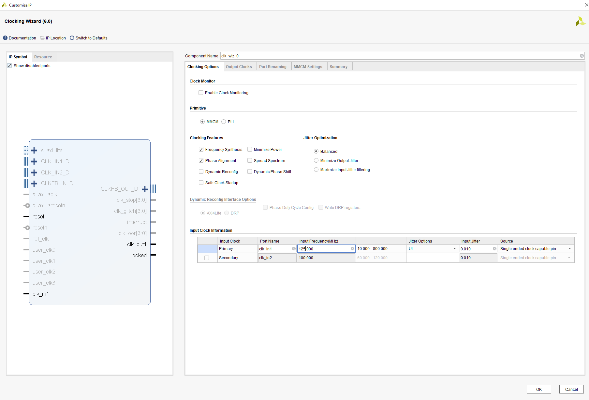  

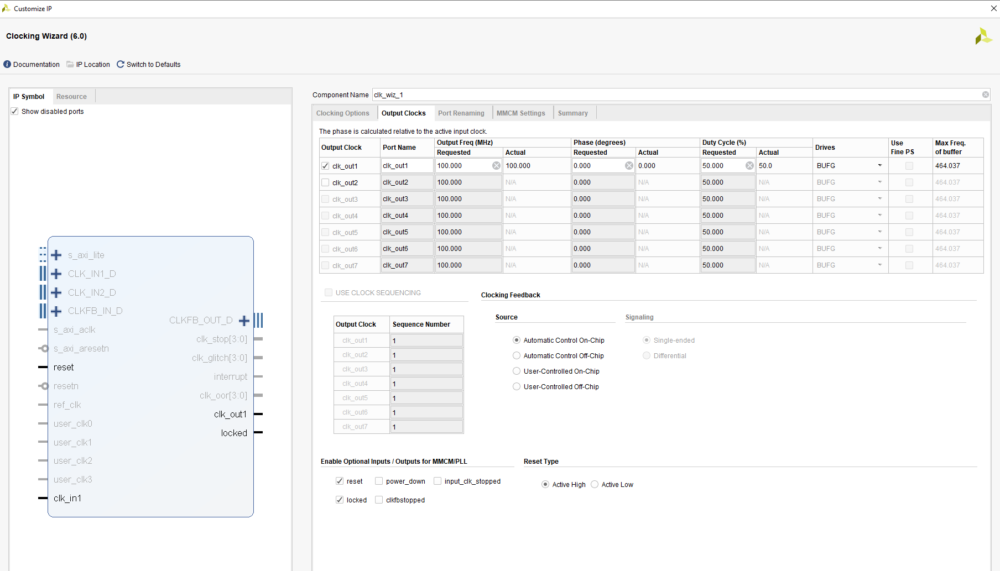  

Установка количества входных портов в Virtual Input/Output

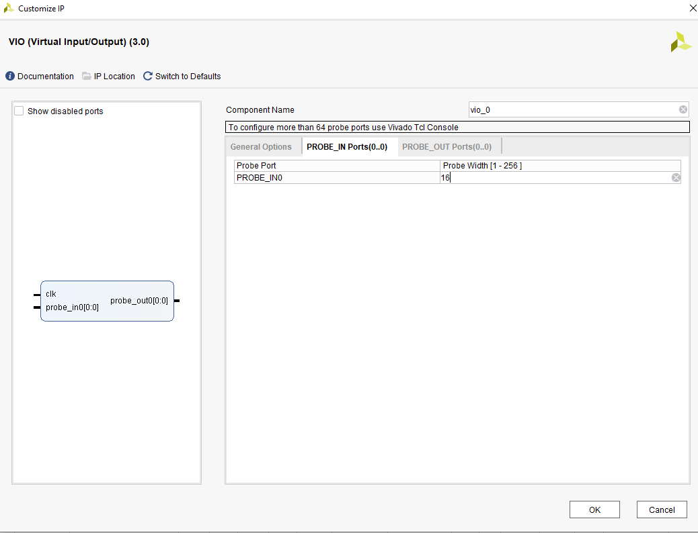  

Установка количества выходных портов в Virtual Input/Output

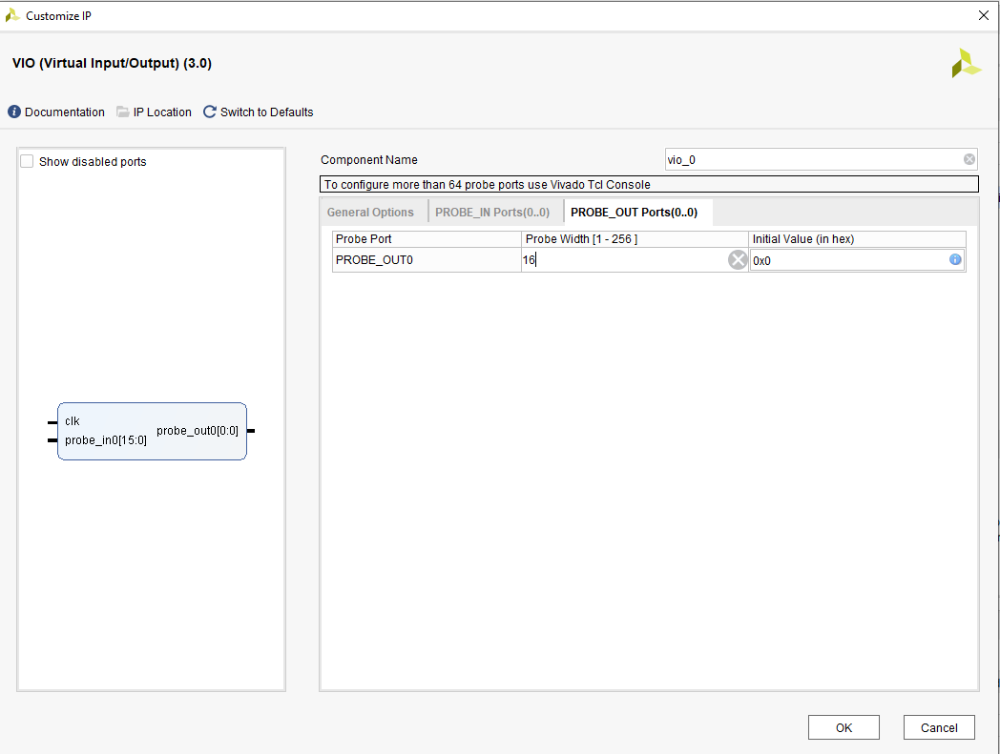  

Подключение к ПЛИС

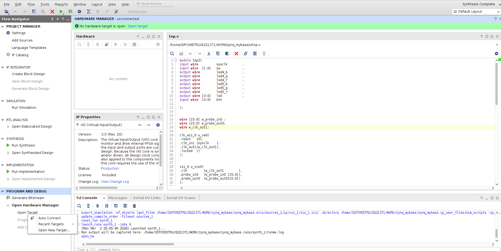  

Загрузка Bitstream на плату

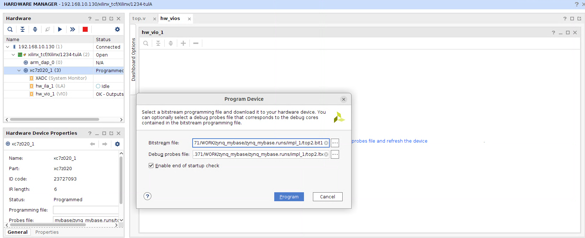 

Интерфейс управления лампочками, с помощью которых можно включать светодиоды на планте

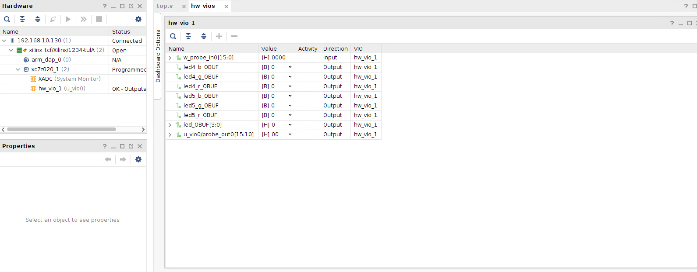 

Общая схема работы всего кода, которая включает как исходный код для управления светодиодами, так и код счётчика. 

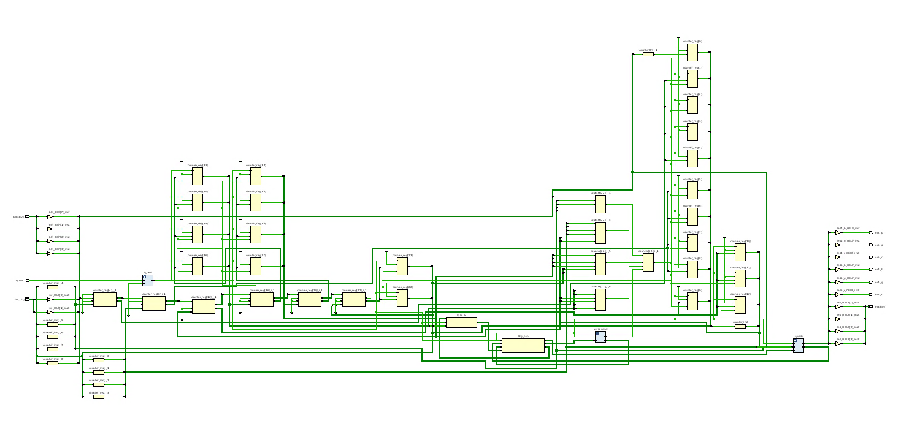 

Добавленный модуль debug

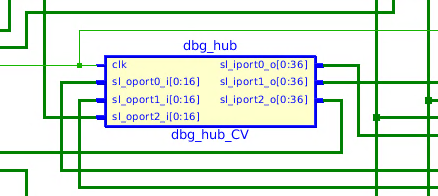 

Подключение к плате и вывод счётчка на диаграмму

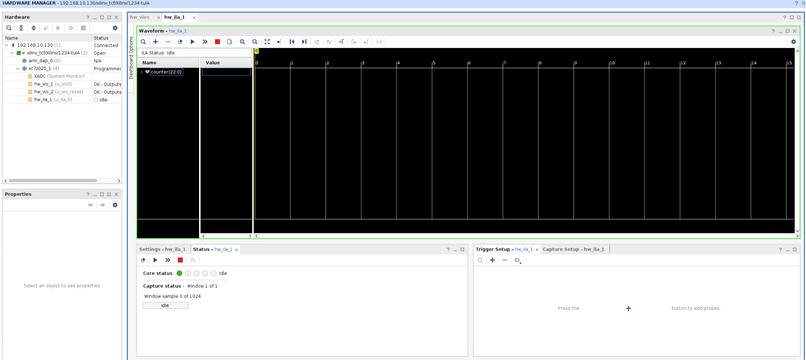 

Установка reset в "0" для проверки работы кода

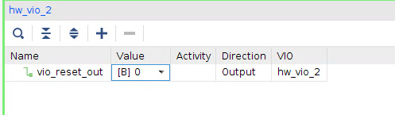 

Настройка триггера на число, соответсвтующее студеническому билету 8221371

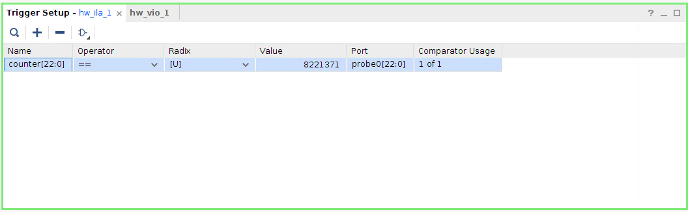 

Запуск кода, триггер поймал момент, когда счётчик равен значению 8221371, после чего происходит сброс и счётчик начинает с нуля

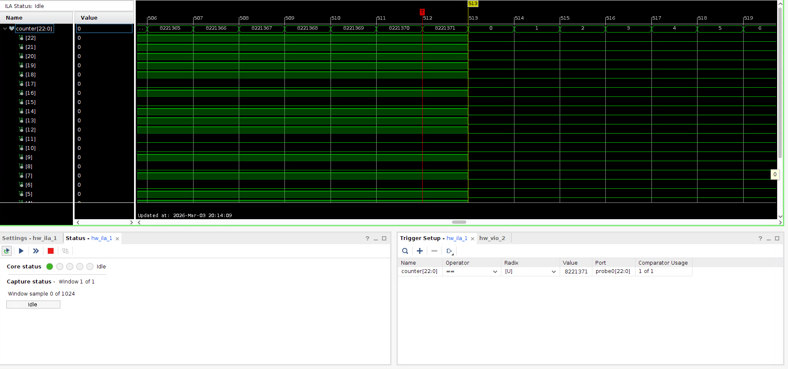 

Плата успешно поймала заданное значение с помощью триггера 

# Код

Модуль top2 в котором описана вся логика работы счётчика

```verilog
module top2(
input wire          sysclk        ,
input wire  [1:0]   sw            ,
output wire         led4_b        ,
output wire         led4_g        ,
output wire         led4_r        ,
output wire         led5_b        ,
output wire         led5_g        ,
output wire         led5_r        ,
output wire [3:0]   led           ,
input wire  [3:0]   btn           
);

wire [15:0] w_probe_in0 ;  
wire [15:0] w_probe_out0; 
wire w_clk_out1;

reg [22:0] counter = 0;

assign w_clk_out1 = sysclk;

always @(posedge w_clk_out1)
begin
    if(counter == 23'd8221371)
        counter <= 23'd0;
    else
        counter <= counter + 1;
end

clk_wiz_0 u_cw0(
.reset   (0),
.clk_in1 (sysclk),
.clk_out1(w_clk_out1),
.locked  () 
);


vio_0 u_vio0(
.clk         (w_clk_out1),
.probe_in0   (w_probe_in0),
.probe_out0  (w_probe_out0) 
);

assign w_probe_in0[3:0] = btn[3:0];
assign w_probe_in0[5:4] = sw [1:0];
assign led4_b        = w_probe_out0[9]  ;
assign led4_g        = w_probe_out0[8]  ;
assign led4_r        = w_probe_out0[7]  ;
assign led5_b        = w_probe_out0[6]  ;
assign led5_g        = w_probe_out0[5]  ;
assign led5_r        = w_probe_out0[4]  ;
assign led     [3:0] = w_probe_out0[3:0];

endmodule
```

# Вывод 
В данной лабораторной работе был реализован счётчик, который доходит до значения 8221371 и обнуляется, а после возобновляет счёт. Работа кода Verilog была проверена на ПЛИС. Результаты получились корректные. 
