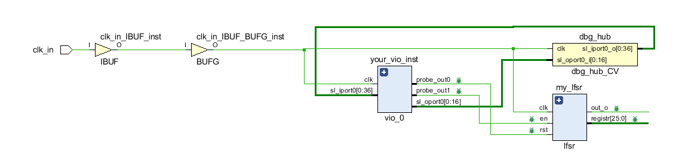
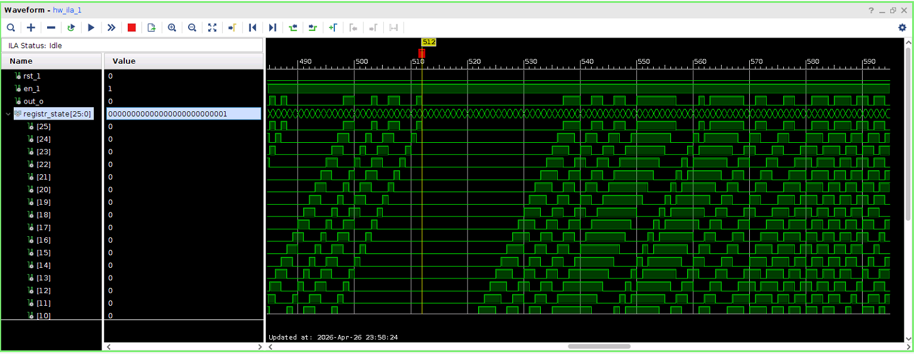
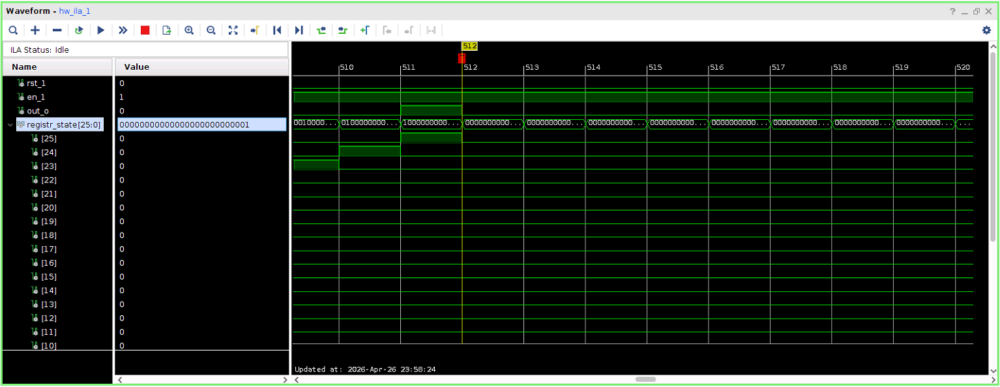
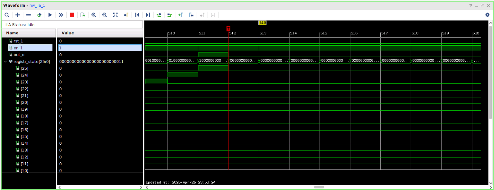
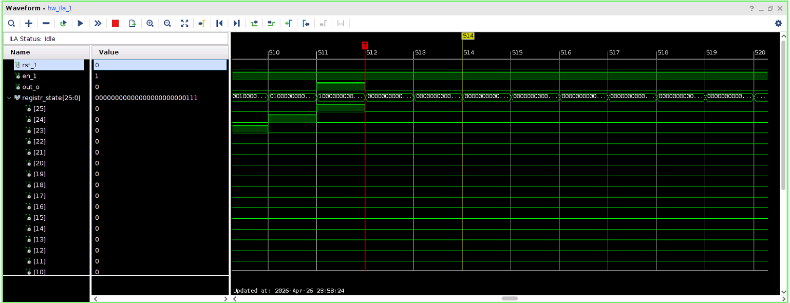
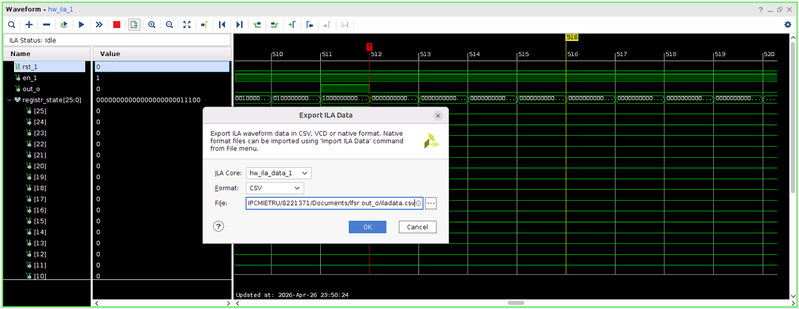

# Отчёт по лабораторной работе №1
## Дисциплина: «Проектирование телекоммуникационных систем на программируемых логических интегральных схемах»
## Название: «Сдвиговый регистр и LFSR»

**Выполнил:**  
Студент группы ИКТ-43
Гайдуков А. М. 

---

Цель выполнения лабораторной работы:
Создание регистр сдвига с обратной связью на Verilog, симуляция LSFR на ПЛИС и сравнение реализации с математической моделью на Python.

---

## 1. Ход лабораторной работы

Первая часть работы оформлена в отдельную лабораторную работу

[Лабораторная работа №0](LR0/Report.md) - Счётчик

С помощью Python кода был получен полином по варианту: [26, 22, 21, 16, 12, 11, 10, 8, 5, 4, 3, 1]

```python
import pylfsr as pyl

var = 4 
poly = list(list(pyl.get_fpolyList(m=26)) + list(pyl.get_fpolyList(m=27)) + list(pyl.get_fpolyList(m=28)) + list(pyl.get_fpolyList(m=29)))[var]
print("Полином:", poly)
```

Общий вид схемы LFSR



Результат работы кода на ПЛИС, с помощью тригера был найден начальный момент для сравнения, когда появился первый бит. 

  

Далее можно проверить работу кода по отчётно проверяя состояния регистров в соответсвии с полиномом.

  

Начало полиномо: 5, 4, 3, 1, соответсвенно после первого входного бита, на следующем такте, появится единица

  

Далее снова появится единица на входе

  

В соответсвии с степенями 3 и 1 полинома на вход подаётся ноль

  

В соответсвии с степенями 4 и 3 полинома на вход подаётся снова ноль

  

Код работает корректно, далее значение также меняется в соответсвии с полиномом. 

Для верификации был скачен файл и из него убрано всё кроме выходного потока бит out_o, который начинает изменятся с 25 такта, до этого он равен нулю. 

# Код

Блок верхнего уровня, который объеденяет LFSR, VIO и ILA:

```verilog
module top(
    input wire clk_in
);
    wire rst;
    wire en;
    wire out_o;
    wire [25:0] registr_state;

    lfsr u_lfsr (
        .clk(clk_in),
        .rst(rst),
        .en(en),
        .out_o(out_o),
        .registr(registr_state)
    );

    vio_0 u_vio (
        .clk(clk_in),
        .probe_out0(rst), 
        .probe_out1(en)   
    );

    ila_0 u_ila (
        .clk(clk_in),
        .probe0(rst),           
        .probe1(en),            
        .probe2(out_o),         
        .probe3(registr_state)  
    );

endmodule
```

Блок LFSR, который реализует всю логику работы

```verilog
module lfsr (
    input  wire        clk,
    input  wire        rst,
    input  wire        en,
    output wire        out_o,
    output wire [25:0] registr 
);
    reg [25:0] shift_reg;
    wire fb = shift_reg[25] ^ shift_reg[21] ^ shift_reg[20] ^ 
              shift_reg[15] ^ shift_reg[11] ^ shift_reg[10] ^ 
              shift_reg[9]  ^ shift_reg[7]  ^ shift_reg[4]  ^ 
              shift_reg[3]  ^ shift_reg[2]  ^ shift_reg[0];

    assign out_o = shift_reg[25];
    assign registr = shift_reg;

    always @(posedge clk) begin
        if (rst) 
            shift_reg <= 26'd1; 
        else if (en) 
            shift_reg <= {shift_reg[24:0], fb}; 
    end
endmodule
```

Верификация проводилась путем сравнения данных, полученных с ПЛИС с помощью ILA и эталонной моделью на Python.

[Файл с 96 выходными битами, полученный на ПЛИС](96.txt)

```python
import numpy as np
from pylfsr import LFSR

def verify_lfsr():
    poly = [26, 22, 21, 16, 12, 11, 10, 8, 5, 4, 3, 1]
    L = LFSR(fpoly = poly, initstate = [1] + [0]*25, conf = 'fibonacci')

    try:
        verilog_data = np.loadtxt('96.txt', dtype=int)
        gold_data = L.runKCycle(len(verilog_data))

        if np.array_equal(verilog_data, gold_data):
            print("Последовательности совпадают")
        else:
            diff = np.where(verilog_data != gold_data)[0][0]
            print(f"Ошибка в бите {diff}: Verilog {verilog_data[diff]}, Python {gold_data[diff]}")

if __name__ == "__main__":
    verify_lfsr()
```

 

Идеализированная модель и полученные значения после симуляции на ПЛИС полностью совпадают

Вывод:
В данной лабораторной работе был реализован регистр сдвига с линейной обратной связью, проверена его работа на ПЛИС. 
Результаты симуляции были сверены с эталонной моделью на Python и полностью совпали, что говорит о корректности результата Verilog кода.


