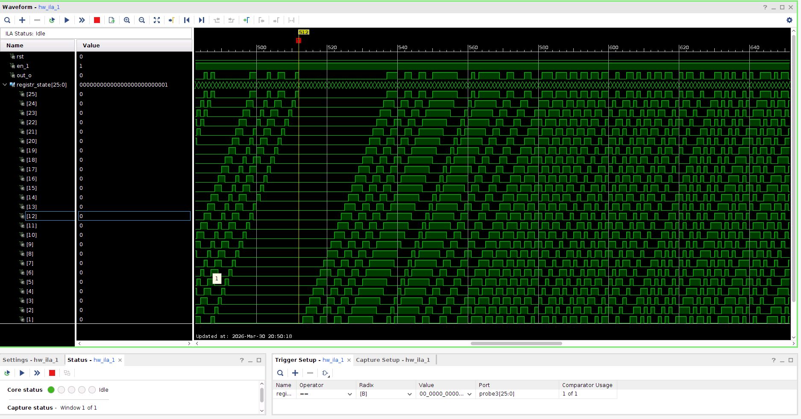
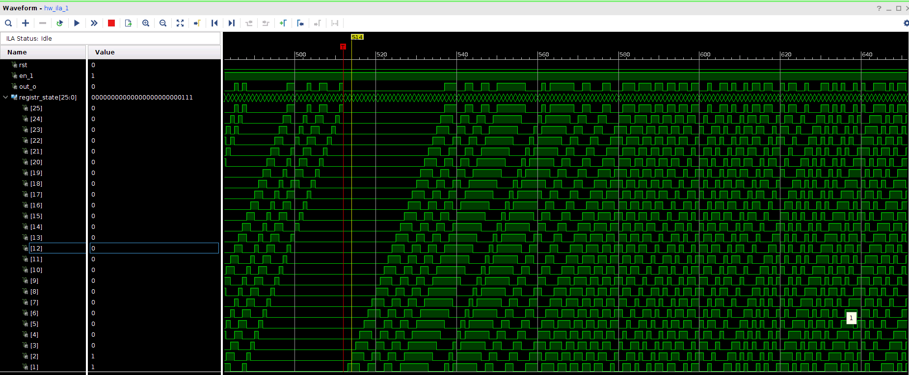

# Отчёт по лабораторной работе №1
## Дисциплина: «Проектирование телекоммуникационных систем на программируемых логических интегральных схемах»
## Название: «NCO»

**Выполнил:**  
Студент группы ИКТ-43
Гайдуков А. М. 

---

Цель выполнения лабораторной работы:
Создание цифрового управляемого генератора и его верификация на Verilog, формирование отсчёта чертвети периода гармонического сигнала на Python. 

---
## 1. Ход лабораторной работы

Результат работы кода на ПЛИС, с помощью тригера был найден начальный момент для сравнения, когда только один бит равен "1". 
  

Второе состояние, после начального 
  

Третье состояние 
  

# Код

```python

```

Блок верхнего уровня, который объеденяет NCO, VIO и ILA:

```verilog
module top(
    input wire clk,
    input wire rst_n,
    input wire start,
    input wire [7:0] step,
    output wire signed [4:0] signal_out
);

    wire nco_rst_n;
    wire nco_enable;
    wire [7:0] nco_phase;

    nco_control #(
        .PHASE_BW(8)
    ) u_control (
        .clk(clk),
        .rst_n(rst_n),
        .start(start),
        .nco_phase(nco_phase),
        .nco_enable(nco_enable),
        .nco_rst_n(nco_rst_n)
    );

    nco #(
        .PHASE_BW(8),
        .ADDR_BW(6),
        .AMP_BW(5)
    ) u_nco (
        .clk(clk),
        .rst_n(nco_rst_n),
        .enable(nco_enable),
        .step(step),
        .phase_out(nco_phase),
        .out(signal_out)
    );

endmodule
```

Блок NCO, который реализует всю логику работы:

```verilog
module nco #(
    parameter PHASE_BW = 8,
    parameter ADDR_BW  = 6,
    parameter AMP_BW   = 5
)(
    input wire clk,
    input wire rst_n,
    input wire enable,
    input wire [PHASE_BW-1:0] step,
    output wire [PHASE_BW-1:0] phase_out,
    output reg signed [AMP_BW-1:0] out
);

    reg [AMP_BW-1:0] lut [0:(1<<ADDR_BW)-1];

    initial begin
        $readmemh("nco_rom_hex.txt", lut);
    end

    reg [PHASE_BW-1:0] phase;
    wire [1:0] quadrant;
    wire [ADDR_BW-1:0] addr_raw;

    reg [ADDR_BW-1:0] addr;
    reg signed [AMP_BW-1:0] sample;

    assign phase_out = phase;
    assign quadrant  = phase[PHASE_BW-1:PHASE_BW-2];
    assign addr_raw  = phase[PHASE_BW-3:0];

    always @(*) begin
        case (quadrant)
            2'b00: begin addr = addr_raw;  sample = lut[addr]; end
            2'b01: begin addr = ~addr_raw; sample = lut[addr]; end
            2'b10: begin addr = addr_raw;  sample = -lut[addr]; end
            2'b11: begin addr = ~addr_raw; sample = -lut[addr]; end
        endcase
    end

    always @(posedge clk) begin
        if (!rst_n) begin
            phase <= 0;
            out   <= 0;
        end else if (enable) begin
            phase <= phase + step;
            out   <= sample;
        end
    end
endmodule
```

```verilog
module counter4bit (
    input clk,
    input rst_n,
    output reg [3:0] out
);

    always @(posedge clk) begin
        if (!rst_n)
            out <= 4'd0;
        else
            out <= out + 1'b1;
    end
endmodule
```
Блок управления, который контролирует NCO 

```verilog
module nco_control #(
    parameter PHASE_BW = 8
)(
    input wire clk,
    input wire rst_n,
    input wire start,
    input wire [PHASE_BW-1:0] nco_phase,

    output reg nco_enable,
    output reg nco_rst_n
);

    reg active;

    always @(posedge clk) begin
        if (!rst_n) begin
            active     <= 0;
            nco_enable <= 0;
            nco_rst_n  <= 0;
        end else begin
            nco_rst_n <= active;

            if (!active) begin
                if (start) begin
                    active     <= 1;
                    nco_enable <= 1;
                    nco_rst_n  <= 1;
                end else begin
                    nco_enable <= 0;
                end
            end else begin
                if (nco_phase >= 128) begin
                    active     <= 0;
                    nco_enable <= 0;
                end
            end
        end
    end
endmodule
```

Код для генерации последовательности из 64 отсчётов для 5 битной амплитуды и создания графика четверти волны сигнала 

```python
import numpy as np
import matplotlib.pyplot as plt

NCO_BW  = 5
ADDR_BW = 6

def sinewave_ROM(nco_bw=NCO_BW, addr_bw=ADDR_BW):
    ampl = 2**(nco_bw-1) - 1   
    ROM_size = 2**addr_bw      
    time = np.linspace(0, 0.25, ROM_size, endpoint=False)
    sinus_rom = np.round(ampl * np.sin(2*np.pi*time)).astype(int)
    return time, sinus_rom

time, sinus_rom = sinewave_ROM()
plt.figure(figsize=(10, 4))
plt.step(range(len(sinus_rom)), sinus_rom, where='post')
plt.title(f"График четверть периода гармонического сигнала заданной разрядности и длительности")
plt.xlabel("Номер отсчёта")
plt.ylabel("Амплитуда")
plt.grid(True)
plt.show() 

digs = int(np.ceil(NCO_BW / 4))  
mask = 2**NCO_BW

with open('nco_rom_hex.txt', 'w') as f:
    for val in sinus_rom:
        val_to_write = val & (mask - 1)
        f.write(f"{val_to_write:0{digs}x}\n")
```


Вывод:
В данной лабораторной работе был реализован 


