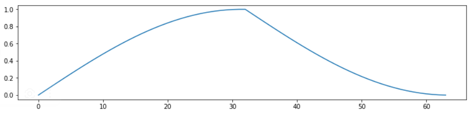
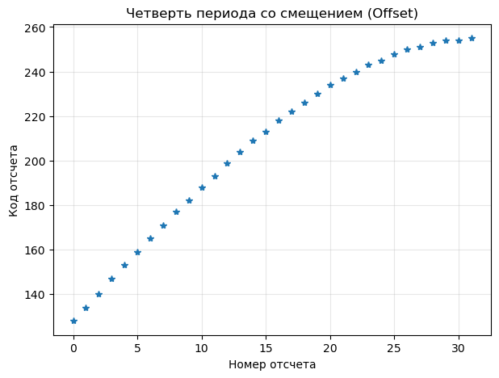
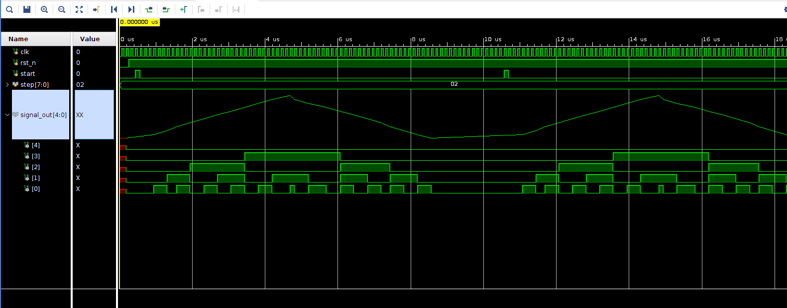
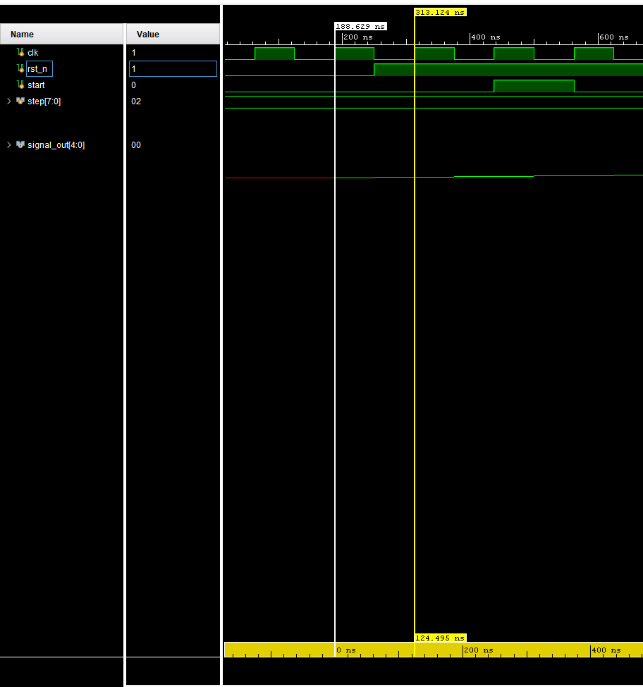
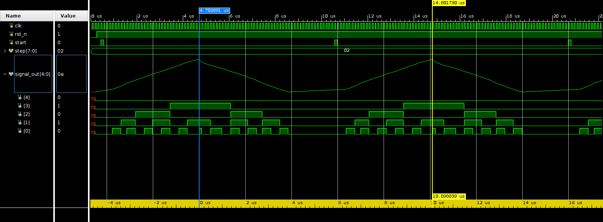

# Отчёт по лабораторной работе №2
## Дисциплина: «Проектирование телекоммуникационных систем на программируемых логических интегральных схемах»
## Название: «NCO»

**Выполнил:**  
Студент группы ИКТ-43
Гайдуков А. М. 
Вариант 4

---

Цель выполнения лабораторной работы:
Создание цифрового управляемого генератора и его верификация на Verilog, формирование отсчёта чертвети периода гармонического сигнала на Python. 

---
## 1. Ход лабораторной работы

Разрядность фазового аккумулятора: 8 бит
Разрядность амплитуды: 5 бит
Целевая частота: 62.5 кГц
Форма сигнала: 
 


Теоретический расчет параметров

Расчёт частоты по формуле  

$f_{out} = \frac{\text{step} \cdot f_{clk}}{2^N}$

Если step = 2, то получаем:

Тактовую частоту: f{clk} = 8 МГц

Период тактового сигнала: T{clk}​ = 125

Длительность импульса : T{pulse}​ = 8 мкс 

Код, который генерирует значения для четверти периода гармонического сигнала  

```python
import math

ADDR_BW = 6
AMP_BW = 5
num_samples = 2**ADDR_BW          
max_amp = (2**(AMP_BW-1)) - 1    

with open("nco_rom_hex.txt", "w") as f:
    for i in range(num_samples):
        val = int(round(max_amp * math.sin((math.pi / 2) * (i / (num_samples - 1)))))
        hex_val = f"{val:02x}"
        f.write(f"{hex_val}\n")
```

Код, который создаёт график четверти периода гармонического сигнала  

```python
import numpy as np
import matplotlib.pyplot as plt

NCO_BW  = 8  
ADDR_BW = 7  

def sinewave_example(nco_bw=NCO_BW, addr_bw=ADDR_BW):
    points = 32
    ampl = 2**(nco_bw-1) - 1 
    offset = 2**(nco_bw-1)   # Смещение 128
    time = np.linspace(0, 0.25, points, endpoint=False)
    sinus_rom = np.round(offset + ampl * np.sin(2*np.pi*time)).astype(int)
    return sinus_rom
    
sinus_rom = sinewave_example()

plt.figure(figsize=(7, 5))
plt.plot(sinus_rom, '*', markersize=6)
plt.title("График четверти периода гармонического сигнала заданной разрядности и длительности")
plt.xlabel("Номер отсчета")
plt.ylabel("Код отсчета")
plt.grid(True, alpha=0.3)
plt.show()
```

  

Временные диаграммы работы NCO

  

Измерение временных параметров

Период тактового сигнала: T{clk}​ = 125 нс

  

Длительность импульса: T{pulse}​ = 10 мкс 

  

Выходной сигнал имеет 64 дискретных отсчета на полуволну, а максимальная амплитуда равна 15, что соответствует 5-битному знаковому представлению. Форма сигнала полностью соответствует варианту.

# Код

Блок верхнего уровня, который объеденяет NCO, VIO и ILA:

```verilog
module top(
    input wire clk,
    input wire rst_n,
    input wire start,
    input wire [7:0] step,
    output wire signed [4:0] signal_out
);

    wire nco_rst_n;
    wire nco_enable;
    wire [7:0] nco_phase;

    nco_control #(
        .PHASE_BW(8)
    ) u_control (
        .clk(clk),
        .rst_n(rst_n),
        .start(start),
        .nco_phase(nco_phase),
        .nco_enable(nco_enable),
        .nco_rst_n(nco_rst_n)
    );

    nco #(
        .PHASE_BW(8),
        .ADDR_BW(6),
        .AMP_BW(5)
    ) u_nco (
        .clk(clk),
        .rst_n(nco_rst_n),
        .enable(nco_enable),
        .step(step),
        .phase_out(nco_phase),
        .out(signal_out)
    );

endmodule
```

Блок NCO, который реализует всю логику работы:

```verilog
module nco #(
    parameter PHASE_BW = 8,
    parameter ADDR_BW  = 6,
    parameter AMP_BW   = 5
)(
    input wire clk,
    input wire rst_n,
    input wire enable,
    input wire [PHASE_BW-1:0] step,
    output wire [PHASE_BW-1:0] phase_out,
    output reg signed [AMP_BW-1:0] out
);

    reg [AMP_BW-1:0] lut [0:(1<<ADDR_BW)-1];

    initial begin
        $readmemh("nco_rom_hex.txt", lut);
    end

    reg [PHASE_BW-1:0] phase;
    wire [1:0] quadrant;
    wire [ADDR_BW-1:0] addr_raw;

    reg [ADDR_BW-1:0] addr;
    reg signed [AMP_BW-1:0] sample;

    assign phase_out = phase;
    assign quadrant  = phase[PHASE_BW-1:PHASE_BW-2];
    assign addr_raw  = phase[PHASE_BW-3:0];

    always @(*) begin
        case (quadrant)
            2'b00: begin addr = addr_raw;  sample = lut[addr]; end
            2'b01: begin addr = ~addr_raw; sample = lut[addr]; end
            2'b10: begin addr = addr_raw;  sample = -lut[addr]; end
            2'b11: begin addr = ~addr_raw; sample = -lut[addr]; end
        endcase
    end

    always @(posedge clk) begin
        if (!rst_n) begin
            phase <= 0;
            out   <= 0;
        end else if (enable) begin
            phase <= phase + step;
            out   <= sample;
        end
    end
endmodule
```

```verilog
module counter4bit (
    input clk,
    input rst_n,
    output reg [3:0] out
);

    always @(posedge clk) begin
        if (!rst_n)
            out <= 4'd0;
        else
            out <= out + 1'b1;
    end
endmodule
```

Блок управления, который контролирует NCO 

```verilog
module nco_control #(
    parameter PHASE_BW = 8
)(
    input wire clk,
    input wire rst_n,
    input wire start,
    input wire [PHASE_BW-1:0] nco_phase,

    output reg nco_enable,
    output reg nco_rst_n
);

    reg active;

    always @(posedge clk) begin
        if (!rst_n) begin
            active     <= 0;
            nco_enable <= 0;
            nco_rst_n  <= 0;
        end else begin
            nco_rst_n <= active;

            if (!active) begin
                if (start) begin
                    active     <= 1;
                    nco_enable <= 1;
                    nco_rst_n  <= 1;
                end else begin
                    nco_enable <= 0;
                end
            end else begin
                if (nco_phase >= 128) begin
                    active     <= 0;
                    nco_enable <= 0;
                end
            end
        end
    end
endmodule
```

# Вывод

В данной лабораторной работе был реализованцифровой генератор NCO, проверена его работа с помощью тестбенча. Результаты симуляции были сравнены с теоретическими расчетами и потдвердили корректность графиков.

