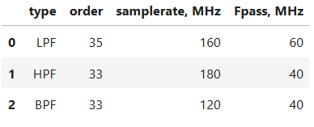

# Отчёт по лабораторной работе №3
## Дисциплина: «Проектирование телекоммуникационных систем на программируемых логических интегральных схемах»
## Название: «Сдвиговый регистр и LFSR»

**Выполнил:**  
Студент группы ИКТ-43
Гайдуков А. М. 
 
---

Цель выполнения
Создание цифровых фильтров (ФНЧ, ФВЧ, Полосового) и их верификации в Vivado

---

## 1. Ход лабораторной работы

Код для генерация значений и видов фильтров по варианту 
```python
import random
import pandas as pd
import numpy as np
import scipy.signal as signal
import matplotlib.pyplot as plt

random.seed(4)
variants = 4
sampling_freq = [random.randrange(100, 260, 20)       for _ in range(1,variants)]
passband_freq = [random.randrange(10, 61, 10)        for _ in range(1,variants)]
order         = [random.randrange(31, 55, 2)          for _ in range(1,variants)]
filter_type   = [random.choice(['LPF', 'HPF', 'BPF']) for _ in range(1,variants)]

variant = pd.DataFrame({'type' : filter_type, 
                        'order': order,
                        'samplerate, MHz': sampling_freq,
                        'Fpass, MHz': passband_freq})

variant
```
В результате получаем следующую таблицу 
  

Вариант 0: 

Фильтор нижних частот, порядок = 35

Частота дискретизации = 160 МГц

Частота пропускания = 60 МГц

Чатсота среза = 70 МГц.

Далее идёт код, который нормирует коэффициенты фильтра так, чтобы сумма была равна единице. Затем с помощью freqz вычисляются амплитудно частотная и фазовая характеристики для исходных и нормированных коэффициентов. Результаты отображаются на графиках. В конце выводятся контрольные значения суммы коэффициентов и их максимального значения.

```python
fir_coefs=np.genfromtxt('V0.csv')
print(fir_coefs)

fir_coeffs_sumto1 = fir_coefs / sum(fir_coefs)

f1, H1 = signal.freqz(fir_coefs,1 )
f2, H2 = signal.freqz(fir_coeffs_sumto1,1 )

fig, ax = plt.subplots(1,2, figsize=(10,4))
ax[0].plot(240 * f1 / 2 /np.pi, abs(H1), 'r')
axx=ax[0].twinx()
axx.plot(240 * f1 / 2 /np.pi, np.unwrap(np.angle(H1)), 'g')

ax[1].plot(240 * f2 / 2 /np.pi, abs(H2), 'r')
axx=ax[1].twinx()
axx.plot(240 * f2 / 2 /np.pi, np.unwrap(np.angle(H2)), 'g')

print(f"{sum(fir_coeffs_sumto1)}")
print(f"{max(fir_coeffs_sumto1)* 2*15}")
```

Далее идёт код, который выполняет нормализацию коэффициентов фильтра, сначала по диапазону [-1, 1], затем немного уменьшает максимум. После этого коэффициенты переводятся в 15-битный целочисленный формат с помощью масштабирования. В конце определяется максимальный по модулю коэффициент.

.png)   

Далее идёт код, который стоит график импульсной характеристики FIR фильтра на основе его коэффициентов. Он отображает отдельные значения коэффициентов во времени

```python
fig, ax = plt.subplots()
ax.stem(fir_coefs)
ax.set_title("Импульсный отклик") 
```

.png)  

Далее идёт код, который генерирует тестовый сигнал, состоящий из полезной синусоиды с частотой пропускания и шумовой составляющей с частотой из полосы подавления. Затем полученный сигнал переводится в 16-битный формат и сохраняется в файл для тестирования фильтра на Verilog.

```python
fs = 160.0 
f_pass = 20.0
f_stop = 75.0 
n_samples = 1000

t = np.arange(n_samples) / fs
clean_signal = 0.5 * np.sin(2 * np.pi * f_pass * t) 
noise_signal = 0.5 * np.sin(2 * np.pi * f_stop * t)
signal_float = clean_signal + noise_signal

signal_int = (signal_float * (2**14)).astype(np.int16)
np.savetxt('input.txt', signal_int, fmt='%d')
```

Далее идёт код, который считывает коэффициенты FIR фильтра из CSV и квантует в 16-битный формат. 
Далее генерируется код на Verilog, включающий линию задержки входного сигнала, набор умножителей для перемножения отсчётов с коэффициентами и дерево сумматоров. 
В конце результат нормализуется и приводится обратно к 16-битному формату на выходе фильтра.

```python
fir_coefs_raw = np.genfromtxt('V0.csv') 
fir_coefs = (fir_coefs_raw / max(abs(fir_coefs_raw)) * (2**15 - 1)).astype(int)

N = len(fir_coefs)
layers = int(np.ceil(np.log2(N)))

with open("fir_filter.v", "w") as f:
    f.write(f"module fir_filter (\n    input clk, rst,\n")
    f.write(f"    input signed [15:0] in,\n")
    f.write(f"    output signed [15:0] out\n);\n\n")
    f.write(f"    reg signed [15:0] r [{N-1}:0];\n")
    f.write(f"    wire signed [15:0] coeff [{N-1}:0];\n")
    for i, c in enumerate(fir_coefs):
        f.write(f"    assign coeff[{i}] = {c};\n")
    
    f.write("\n    always @(posedge clk) begin\n")
    f.write("        if (rst) begin\n            for (integer j=0; j<{0}; j=j+1) r[j] <= 0;\n        end else begin\n".format(N))
    f.write("            r[0] <= in;\n")
    for i in range(1, N):
        f.write(f"            r[{i}] <= r[{i-1}];\n")
    f.write("        end\n    end\n\n")

    f.write(f"    wire signed [31:0] mult [{N-1}:0];\n")
    for i in range(N):
        f.write(f"    assign mult[{i}] = r[{i}] * coeff[{i}];\n")

    curr_n = N
    layer_idx = 0
    
    prev_width = 32
    prev_prefix = "mult"
    
    while curr_n > 1:
        next_n = (curr_n + 1) // 2
        next_width = prev_width + 1
        prefix = f"L{layer_idx}"
        
        f.write(f"\n    // Layer {layer_idx}: {curr_n} inputs -> {next_n} outputs\n")
        f.write(f"    wire signed [{next_width-1}:0] {prefix} [{next_n-1}:0];\n")
        
        for i in range(next_n):
            if 2*i + 1 < curr_n:
                f.write(f"    assign {prefix}[{i}] = {prev_prefix}[{2*i}] + {prev_prefix}[{2*i+1}];\n")
            else:
                # Если число входов нечетное, просто пробрасываем последний
                f.write(f"    assign {prefix}[{i}] = {prev_prefix}[{2*i}];\n")
        
        prev_prefix = prefix
        prev_width = next_width
        curr_n = next_n
        layer_idx += 1

    f.write(f"\n    assign out = {prev_prefix}[0][30:15]; // Нормализация\n")
    f.write("\nendmodule")
```

С помощью полученного Verilog кода идёт создание файла output_rtl0 для дальнейшего сравнения. 

Далее идёт код, который вычисляет выход FIR фильтра в Python с помощью функции lfilter, а после этого строится график, сравнивающий математическую модель и результат симуляции на Verilog.

```python
x = np.loadtxt('input0.txt')
y_rtl = np.loadtxt('output_rtl0.txt')

y_py = signal.lfilter(fir_coefs, [1.0], x) / (2**15)

plt.figure(figsize=(12, 6))
plt.plot(y_py[100:200], 'r-', label='Математическая модель (Python)')
plt.plot(y_rtl[100:200], 'b--', label='Результат симуляции (RTL)')
plt.title("Верификация КИХ-фильтра")
plt.grid(True)
plt.legend()
plt.show()
```
.png)  

По данному графику видно, что реализация на Verilog совпадает с эталонным кодом на Python

Вариант 1: 

Фильтр верхних частот, порядок = 33

Частота дискретизации = 180 МГц 

Частота пропускания = 40 МГц

Чатсота среза = 30 МГц

Далее идёт код, который нормирует коэффициенты фильтра так, чтобы сумма была равна единице. Затем с помощью freqz вычисляются амплитудно частотная и фазовая характеристики для исходных и нормированных коэффициентов. Результаты отображаются на графиках. В конце выводятся контрольные значения суммы коэффициентов и их максимального значения.

```python
fir_coefs=np.genfromtxt('V1.csv')
print(fir_coefs)

fir_coeffs_sumto1 = fir_coefs / sum(fir_coefs)
f1, H1 = signal.freqz(fir_coefs,1 )
f2, H2 = signal.freqz(fir_coeffs_sumto1,1 )
fig, ax = plt.subplots(1,2, figsize=(10,4))
ax[0].plot(240 * f1 / 2 /np.pi, abs(H1), 'r')
axx=ax[0].twinx()
axx.plot(240 * f1 / 2 /np.pi, np.unwrap(np.angle(H1)), 'g')

ax[1].plot(240 * f2 / 2 /np.pi, abs(H2), 'r')
axx=ax[1].twinx()
axx.plot(240 * f2 / 2 /np.pi, np.unwrap(np.angle(H2)), 'g')

print(f"{sum(fir_coeffs_sumto1)}")
print(f"{max(fir_coeffs_sumto1)* 2*15}")
```

.png)  

Далее идёт код, который выполняет нормализацию коэффициентов фильтра, сначала по диапазону [-1, 1], затем немного уменьшает максимум. После этого коэффициенты переводятся в 15-битный целочисленный формат с помощью масштабирования. В конце определяется максимальный по модулю коэффициент.

```python
fir_coefs=np.genfromtxt('V1.csv')

fir_coefs = fir_coefs / max(abs(fir_coefs))
print(f"Norm to 1.0: {max(abs(fir_coefs))=}")

fir_coefs = fir_coefs * (1-2**-15)
print(f"Norm to 0.99999: {max(abs(fir_coefs))=}")


fir_coefs = (np.floor(fir_coefs * 2**15)).astype(int)
print(f"Norm to maximum 15-bit integer: {max(abs(fir_coefs))=}")

max_pos = np.argmax(abs(fir_coefs))
print(f"Norm to maximum 15-bit integer: {max_pos=} {fir_coefs[max_pos]}")
```

Далее идёт код, который стоит график импульсной характеристики FIR фильтра на основе его коэффициентов. Он отображает отдельные значения коэффициентов во времени

```python
fig, ax = plt.subplots()
ax.stem(fir_coefs)
ax.set_title("Импульсный отклик") 
```

.png)  

Далее идёт код, который генерирует тестовый сигнал, состоящий из полезной синусоиды с частотой пропускания и шумовой составляющей с частотой из полосы подавления. Затем полученный сигнал переводится в 16-битный формат и сохраняется в файл для тестирования фильтра на Verilog.

```python
fs = 180.0
f_pass = 60.0
f_stop = 20.0 
n_samples = 1000

t = np.arange(n_samples) / fs

clean_signal = 0.5 * np.sin(2 * np.pi * f_pass * t) 
noise_signal = 0.5 * np.sin(2 * np.pi * f_stop * t)
signal_float = clean_signal + noise_signal

signal_int = (signal_float * (2**14)).astype(np.int16)

np.savetxt('input.txt', signal_int, fmt='%d')
```

Далее идёт код, который считывает коэффициенты FIR фильтра из CSV и квантует в 16-битный формат. 
Далее генерируется код на Verilog, включающий линию задержки входного сигнала, набор умножителей для перемножения отсчётов с коэффициентами и дерево сумматоров. 
В конце результат нормализуется и приводится обратно к 16-битному формату на выходе фильтра.

```python
fir_coefs_raw = np.genfromtxt('V1.csv') 
fir_coefs = (fir_coefs_raw / max(abs(fir_coefs_raw)) * (2**15 - 1)).astype(int)

N = len(fir_coefs)
layers = int(np.ceil(np.log2(N)))

with open("fir_filter.v", "w") as f:
    f.write(f"module fir_filter (\n    input clk, rst,\n")
    f.write(f"    input signed [15:0] in,\n")
    f.write(f"    output signed [15:0] out\n);\n\n")

    # 1. Линия задержки и коэффициенты
    f.write(f"    reg signed [15:0] r [{N-1}:0];\n")
    f.write(f"    wire signed [15:0] coeff [{N-1}:0];\n")
    for i, c in enumerate(fir_coefs):
        f.write(f"    assign coeff[{i}] = {c};\n")
    
    f.write("\n    always @(posedge clk) begin\n")
    f.write("        if (rst) begin\n            for (integer j=0; j<{0}; j=j+1) r[j] <= 0;\n        end else begin\n".format(N))
    f.write("            r[0] <= in;\n")
    for i in range(1, N):
        f.write(f"            r[{i}] <= r[{i-1}];\n")
    f.write("        end\n    end\n\n")

    f.write(f"    wire signed [31:0] mult [{N-1}:0];\n")
    for i in range(N):
        f.write(f"    assign mult[{i}] = r[{i}] * coeff[{i}];\n")

    curr_n = N
    layer_idx = 0
    prev_width = 32
    prev_prefix = "mult"
    
    while curr_n > 1:
        next_n = (curr_n + 1) // 2
        next_width = prev_width + 1
        prefix = f"L{layer_idx}"
        
        f.write(f"\n    // Layer {layer_idx}: {curr_n} inputs -> {next_n} outputs\n")
        f.write(f"    wire signed [{next_width-1}:0] {prefix} [{next_n-1}:0];\n")
        
        for i in range(next_n):
            if 2*i + 1 < curr_n:
                f.write(f"    assign {prefix}[{i}] = {prev_prefix}[{2*i}] + {prev_prefix}[{2*i+1}];\n")
            else:
                f.write(f"    assign {prefix}[{i}] = {prev_prefix}[{2*i}];\n")
        
        prev_prefix = prefix
        prev_width = next_width
        curr_n = next_n
        layer_idx += 1

    f.write(f"\n    assign out = {prev_prefix}[0][30:15];\n")
    f.write("\nendmodule")
```

С помощью полученного Verilog кода идёт создание файла output_rtl0 для дальнейшего сравнения. 

Далее идёт код, который вычисляет выход FIR фильтра в Python с помощью функции lfilter, а после этого строится график, сравнивающий математическую модель и результат симуляции на Verilog.

import matplotlib.pyplot as plt

x = np.loadtxt('input1.txt')
y_rtl = np.loadtxt('output_rtl1.txt')

y_py = signal.lfilter(fir_coefs, [1.0], x) / (2**15)

plt.figure(figsize=(12, 6))
plt.plot(y_py[100:200], 'r-', label='Математическая модель (Python)')
plt.plot(y_rtl[100:200], 'b--', label='Результат симуляции (RTL)')
plt.title("Верификация КИХ-фильтра")
plt.grid(True)
plt.legend()
plt.show()
```
.png)  

По данному графику видно, что реализация на Verilog совпадает с эталонным кодом на Python, но сдвинут во времени

Вариант 2: Полосовой фильтр, порядок = 33

Частота дискретизации = 120 МГц

Частота пропускания (1) = 10 МГц

Частота пропускания (2) = 50 МГц

Чатсота среза (1) = 0 МГц

Чатсота среза (2) = 60 МГц

Далее идёт код, который нормирует коэффициенты фильтра так, чтобы сумма была равна единице. Затем с помощью freqz вычисляются амплитудно частотная и фазовая характеристики для исходных и нормированных коэффициентов. Результаты отображаются на графиках. В конце выводятся контрольные значения суммы коэффициентов и их максимального значения.

```python
fir_coefs=np.genfromtxt('V2.csv')
print(fir_coefs)

fir_coeffs_sumto1 = fir_coefs / sum(fir_coefs)

f1, H1 = signal.freqz(fir_coefs,1 )
f2, H2 = signal.freqz(fir_coeffs_sumto1,1 )

fig, ax = plt.subplots(1,2, figsize=(10,4))
ax[0].plot(240 * f1 / 2 /np.pi, abs(H1), 'r')
axx=ax[0].twinx()
axx.plot(240 * f1 / 2 /np.pi, np.unwrap(np.angle(H1)), 'g')

ax[1].plot(240 * f2 / 2 /np.pi, abs(H2), 'r')
axx=ax[1].twinx()
axx.plot(240 * f2 / 2 /np.pi, np.unwrap(np.angle(H2)), 'g')

print(f"{sum(fir_coeffs_sumto1)}")
print(f"{max(fir_coeffs_sumto1)* 2*15}")
```

.png)  

Далее идёт код, который выполняет нормализацию коэффициентов фильтра, сначала по диапазону [-1, 1], затем немного уменьшает максимум. После этого коэффициенты переводятся в 15-битный целочисленный формат с помощью масштабирования. В конце определяется максимальный по модулю коэффициент.

```python
fir_coefs=np.genfromtxt('V2.csv')
fir_coefs = fir_coefs / max(abs(fir_coefs))
print(f"Norm to 1.0: {max(abs(fir_coefs))=}")
fir_coefs = fir_coefs * (1-2**-15)
print(f"Norm to 0.99999: {max(abs(fir_coefs))=}")

fir_coefs = (np.floor(fir_coefs * 2**15)).astype(int)
print(f"Norm to maximum 15-bit integer: {max(abs(fir_coefs))=}")

max_pos = np.argmax(abs(fir_coefs))
print(f"Norm to maximum 15-bit integer: {max_pos=} {fir_coefs[max_pos]}")
```

Далее идёт код, который стоит график импульсной характеристики FIR фильтра на основе его коэффициентов. Он отображает отдельные значения коэффициентов во времени

```python
fig, ax = plt.subplots()
ax.stem(fir_coefs)
ax.set_title("Импульсный отклик") 
```

.png)  

Далее идёт код, который считывает коэффициенты FIR фильтра из CSV и квантует в 16-битный формат. 
Далее генерируется код на Verilog, включающий линию задержки входного сигнала, набор умножителей для перемножения отсчётов с коэффициентами и дерево сумматоров. 
В конце результат нормализуется и приводится обратно к 16-битному формату на выходе фильтра.

```python
fs = 120.0
f_pass = 30.0
f_stop = 10.0 
n_samples = 1000

t = np.arange(n_samples) / fs
clean_signal = 0.5 * np.sin(2 * np.pi * f_pass * t) 
noise_signal = 0.5 * np.sin(2 * np.pi * f_stop * t)
signal_float = clean_signal + noise_signal
signal_int = (signal_float * (2**14)).astype(np.int16)

np.savetxt('input.txt', signal_int, fmt='%d')
```

Далее идёт код, который генерирует тестовый сигнал, состоящий из полезной синусоиды с частотой пропускания и шумовой составляющей с частотой из полосы подавления. Затем полученный сигнал переводится в 16-битный формат и сохраняется в файл для тестирования фильтра на Verilog.

```python
fir_coefs_raw = np.genfromtxt('V2.csv') 
fir_coefs = (fir_coefs_raw / max(abs(fir_coefs_raw)) * (2**15 - 1)).astype(int)
N = len(fir_coefs)
layers = int(np.ceil(np.log2(N)))
with open("fir_filter.v", "w") as f:
    f.write(f"module fir_filter (\n    input clk, rst,\n")
    f.write(f"    input signed [15:0] in,\n")
    f.write(f"    output signed [15:0] out\n);\n\n")
    f.write(f"    reg signed [15:0] r [{N-1}:0];\n")
    f.write(f"    wire signed [15:0] coeff [{N-1}:0];\n")
    for i, c in enumerate(fir_coefs):
        f.write(f"    assign coeff[{i}] = {c};\n")
    
    f.write("\n    always @(posedge clk) begin\n")
    f.write("        if (rst) begin\n            for (integer j=0; j<{0}; j=j+1) r[j] <= 0;\n        end else begin\n".format(N))
    f.write("            r[0] <= in;\n")
    for i in range(1, N):
        f.write(f"            r[{i}] <= r[{i-1}];\n")
    f.write("        end\n    end\n\n")

    f.write(f"    wire signed [31:0] mult [{N-1}:0];\n")
    for i in range(N):
        f.write(f"    assign mult[{i}] = r[{i}] * coeff[{i}];\n")

    curr_n = N
    layer_idx = 0
    prev_width = 32
    prev_prefix = "mult"
    
    while curr_n > 1:
        next_n = (curr_n + 1) // 2
        next_width = prev_width + 1
        prefix = f"L{layer_idx}"
        
        f.write(f"\n    // Layer {layer_idx}: {curr_n} inputs -> {next_n} outputs\n")
        f.write(f"    wire signed [{next_width-1}:0] {prefix} [{next_n-1}:0];\n")
        
        for i in range(next_n):
            if 2*i + 1 < curr_n:
                f.write(f"    assign {prefix}[{i}] = {prev_prefix}[{2*i}] + {prev_prefix}[{2*i+1}];\n")
            else:
                f.write(f"    assign {prefix}[{i}] = {prev_prefix}[{2*i}];\n")
        
        prev_prefix = prefix
        prev_width = next_width
        curr_n = next_n
        layer_idx += 1

    f.write(f"\n    assign out = {prev_prefix}[0][30:15]; // Нормализация\n")
    f.write("\nendmodule")
```

Далее идёт код, который считывает коэффициенты FIR фильтра из CSV и квантует в 16-битный формат. 
Далее генерируется код на Verilog, включающий линию задержки входного сигнала, набор умножителей для перемножения отсчётов с коэффициентами и дерево сумматоров. 
В конце результат нормализуется и приводится обратно к 16-битному формату на выходе фильтра.

```python
import matplotlib.pyplot as plt
x = np.loadtxt('input2.txt')
y_rtl = np.loadtxt('output_rtl2.txt')
y_py = signal.lfilter(fir_coefs, [1.0], x) / (2**15)

plt.figure(figsize=(12, 6))
plt.plot(y_py[100:200], 'r-', label='Математическая модель (Python)')
plt.plot(y_rtl[100:200], 'b--', label='Результат симуляции (RTL)')
plt.title("Верификация КИХ-фильтра")
plt.grid(True)
plt.legend()
plt.show()
```
С помощью полученного Verilog кода идёт создание файла output_rtl0 для дальнейшего сравнения. 

Далее идёт код, который вычисляет выход FIR фильтра в Python с помощью функции lfilter, а после этого строится график, сравнивающий математическую модель и результат симуляции на Verilog.

.png)  

По данному графику видно, что реализация на Verilog совпадает с эталонным кодом на Python, но сдвинут во времени


Код
Вывод


